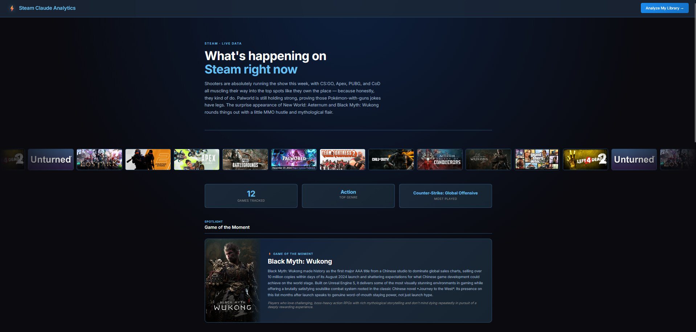
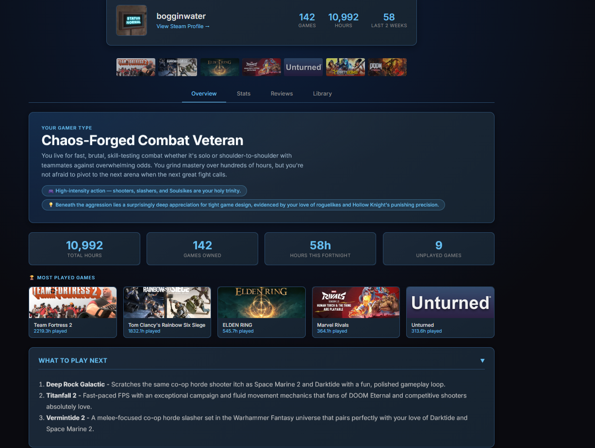

# Steam Claude Analytics

An AI-powered Steam library analyzer and gaming stats dashboard built with FastAPI and Claude AI.

## What it does

**Landing page** — a live Steam stats dashboard showing trending games, hidden gems, genre breakdowns, and AI-generated commentary updated every 4 hours.

**Analyzer** — enter your Steam ID to get a personalized breakdown of your gaming library including:
- Gaming personality profile and gamer archetype
- AI-powered game recommendations for games you don't own
- Achievement tracking and hunter score
- Genre breakdown charts
- Backlog estimator (single player games only)
- Review analysis for any game in your library
- Mood-based game picker from your unplayed backlog
- Recent activity and most played showcase
- Screenshot of the landing page below.

- Screenshot of the analyzer below


## Tech stack

- **Backend** — FastAPI, Python, SQLite (via SQLModel)
- **AI** — Anthropic Claude (claude-sonnet-4-6)
- **APIs** — Steam Web API, RAWG, SteamSpy
- **Frontend** — Vanilla HTML/CSS/JS, Chart.js

## Setup

### 1. Clone the repo

```bash
git clone https://github.com/yourusername/steam-claude-analytics.git
cd steam-claude-analytics
```

### 2. Install dependencies

```bash
pip install -r requirements.txt
```

### 3. Get API keys

You'll need four API keys:

- **Steam API key** — get one at https://steamcommunity.com/dev/apikey
- **Anthropic API key** — get one at https://console.anthropic.com
- **RAWG API key** — get one at https://rawg.io/apidocs
- **SteamSpy** — no key needed, free public API

### 4. Create a `.env` file

Insert these into your .env file along with your keys.

STEAM_API_KEY=your_steam_key_here
ANTHROPIC_API_KEY=your_anthropic_key_here
RAWG_API_KEY=your_rawg_key_here

### 5. Run the app

```bash
uvicorn main:app --reload
```

Then visit `http://localhost:8000`

## Notes

- Steam profile must be set to **public** with **Game Details** also set to public
- Find your Steam ID at https://steamid.io
- First analysis of a Steam ID takes 30-60 seconds — subsequent loads are cached for 4 hours
- Steam Family shared games are not included in the library (Steam API limitation)
- If you do not have a steam ID, use this one 76561198155547142.
